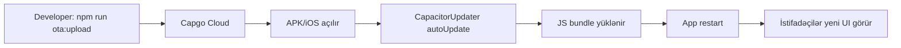

# Capgo OTA (Live Update) — SuMan Admin

JS/UI dəyişiklikləri **mağaza/APK yenidən paylamadan** Android + iOS-da yenilənir.

**OTA ilə yenilənmir:** native plugin, `Podfile`, `AndroidManifest`, Firebase faylları, yeni icazələr → yeni binary build lazımdır.

---

## 1. Bir dəfəlik quraşdırma (Capgo hesabı)

1. [capgo.app](https://capgo.app) → hesab yaradın
2. [API Keys](https://console.capgo.app/dashboard/apikeys) → API key kopyalayın
3. Layihə kökündə:

```bash
npx @capgo/cli@latest init YOUR_API_KEY
```

CLI sorğularına cavab verin (app: `az.khamsacraft.suman.admin`).  
Əgər Capgo-da app ID fərqlidirsə, `.env` və ya build zamanı:

```bash
export CAPGO_APP_ID=your-capgo-app-id
```

4. Channel: **production** (default), test üçün **staging** yarada bilərsiniz

5. **İlk dəfə OTA-dan əvvəl** istifadəçilərə Capgo plugin-li **yeni APK/iOS** verin:

```bash
npm run cap:sync
npm run android:apk   # Android
# iOS: npm run ios → Xcode Run
```

---

## 2. Kod dəyişəndən sonra (OTA buraxılış)

```bash
# 1) Web bundle (production API)
npm run build:mobile

# 2) Capgo-ya yüklə
npm run ota:upload
# və ya staging:
npm run ota:upload:staging
```

3. Telefonda tətbiqi **bağlayıb yenidən açın** (və ya background → foreground)  
4. Yeni versiya yüklənəndən sonra restart ilə aktiv olur

---

## 3. Yoxlama

```bash
npx @capgo/cli@latest app debug
```

Login → heç bir xəta yoxdur. UI dəyişikliyini görmək üçün app restart edin.

---

## 4. Axın



---

## 5. Problem?

| Simptom | Həll |
|---------|------|
| Update gəlmir | Köhnə APK Capgo plugin-sizdir → yeni binary paylayın |
| Rollback / ağ ekran | `notifyAppReady` çağırılmır — `CapgoUpdater` layout-da olmalıdır |
| Yanlış channel | `defaultChannel: production` və ya CLI-də `--channel=staging` |
| Native dəyişiklik | OTA yetərli deyil → `cap:sync` + yeni APK/iOS |

Plugin: `@capgo/capacitor-updater@lts-v6` (Capacitor 6).
